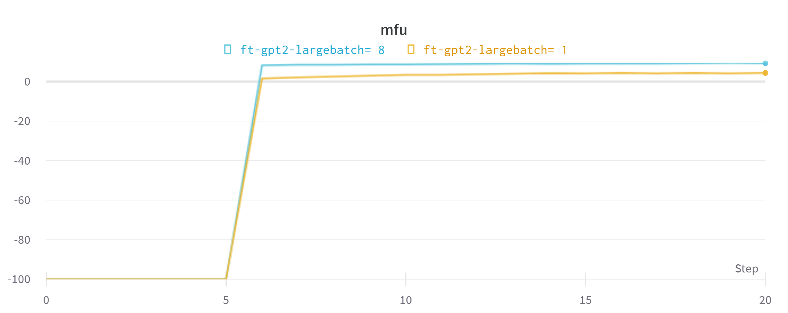
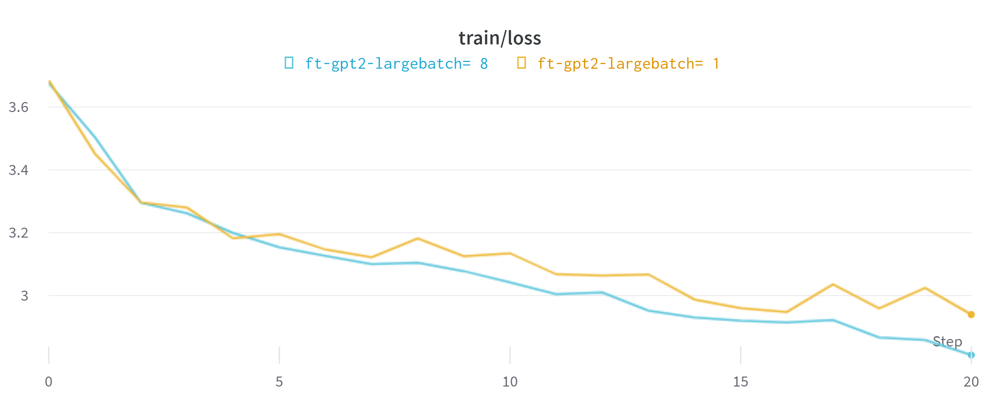
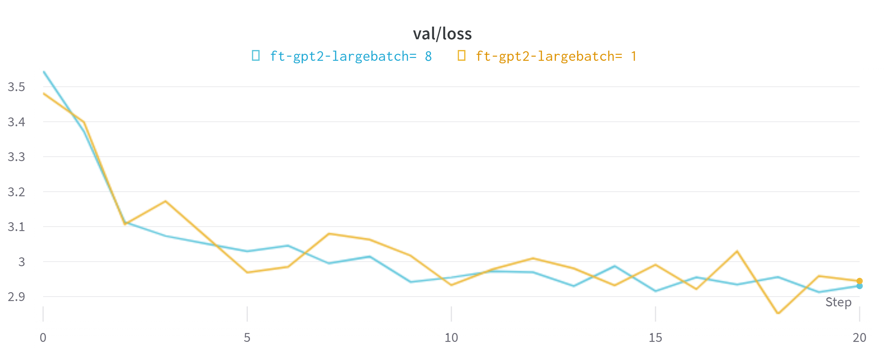

# 참고자료
[readme-orginal](README-original.md)

# fine tuning setting
```python

dataset = 'shakespeare'
init_from = 'gpt2-large' # this is the largest GPT-2 model

# only save checkpoints if the validation loss improves
always_save_checkpoint = False

# the number of examples per iter:
# 1 batch_size * 32 grad_accum * 1024 tokens = 32,768 tokens/iter
# shakespeare has 301,966 tokens, so 1 epoch ~= 9.2 iters
batch_size = 8 #or 1
gradient_accumulation_steps = 32
max_iters = 20

# finetune at constant LR
learning_rate = 3e-5
decay_lr = False

eval_interval = 1
eval_iters = 40
wandb_log = True # feel free to turn on
wandb_project = 'shakespeare-finetune'
wandb_run_name = 'ft-' + init_from + f'batch= {batch_size}'
out_dir = 'out-shakespeare'+ wandb_run_name
```

# 실험 세팅
## Pretrained model
gpt2-xl을 사용했을 때, 인공지능학과 A100 40GB 환경에서의 모델 파인튜닝이 불가능하였다.
따라서 GPT2-Large(774m)을 배치 사이즈를 달리하여 파인튜닝 진행하였다.
## 개발 환경 설정
A100 40GB \
torch 2.0(for torch.compile) \
other settings are in [requirements.txt](requirements.txt)


# 결과 분석
## MFU

"Model Flops Utilization"은 딥 러닝 모델에서 효율적인 연산을 위해 계산되는 플로팅 연산(FLOPS)의 비율을 나타내는 지표이다. 

FLOPS는 초당 부동 소수점 연산 횟수를 의미하는데, 딥 러닝 모델의 복잡도를 측정하는 데 사용된다.\
Model Flops Utilization은 모델이 계산하는 FLOPS 중에서 실제로 사용되는 비율이다. 높은 Flops Utilization은 모델이 효율적으로 동작하고 있음을 나타내며, 낮은 Flops Utilization은 모델이 일부 연산에서 불필요한 계산을 하고 있거나, 다른 문제가 발생하고 있을 수 있다는 의미이다. \
두 batch size에서의 flops utilization은 6에폭째에서 상승함을 알 수 있는데, 배치사이즈가 더 큰 모델에서의 utilization이 높음을 확인할 수 있다.


## LOSS
학습 과정에 따른 loss 변화는 아래와 같으며, 배치사이즈가 더 큰 경우에서 validation loss 측면에서 더 안정적인 학습이 진행되는 것을 확인할 수 있다. 이는 큰 배치 사이즈가 layer normalization에 따른 효과를 더 잘 받기 때문이다.



## sample

### pure gpt2-large model
```bash
python sample.py \
    --init_from=gpt2-large \
    --start="What is the answer to life, the universe, and everything?" \
    --num_samples=5 --max_new_tokens=100
```
the output is:

```
What is the answer to life, the universe, and everything?

Submit your answer to this riddle below for a chance to win a $25 Amazon gift card!

Answers can be found here!<|endoftext|>Please fill in the form below.

When will I receive my order?

After placing your order you will receive an email with the tracking number.

What is the shipping cost to me?

We ship via USPS Priority Mail. To find a tracking number you can access our shipping page.

Where can I
---------------
What is the answer to life, the universe, and everything? Probably nothing. Try to answer these questions with the facts and data that prove the existence of God. Then see if it is really true that the universe exists because of one supernatural being or because of a multitude of supernatural beings.<|endoftext|>C# Script

Description

This script is used to see how the user interacts with the cmdlets in the C# language.

The script uses the C# language, so it will only run on Windows.

This is an example of a
---------------
What is the answer to life, the universe, and everything?


Can a man be compassionate, just, and kind if he is not sure of what he has got?


Do we care what happens if one child is born and the second and third children don't go to school, or if they never go to school?


We don't know what the future holds, and we don't know what the future holds for us.


We are doing all we can to make sure the children go to school. Only by giving them the
---------------
What is the answer to life, the universe, and everything? Just be yourself! You are gorgeous, you are smart, you are funny, you are smart and you are beautiful. See YOURSELF in the mirror every morning. Discover YOURSELF through the things I do. See YOURSELF in the people I'm with. See YOURSELF in the food I eat. See YOURSELF on the street. See YOURSELF in the people I meet. See YOURSELF in everything. Because we are beautiful. Because we are smart.
---------------
What is the answer to life, the universe, and everything? This question has been posed in many religions, including Buddhism, Christianity, Hinduism, Islam, and Judaism (to name a few). But how can a religion answer a question that has no simple answer?

We seek an answer to this question by examining the nature of religion and why it seems to be an issue that is difficult to answer.

What is the nature of religion?

Religion is an unverifiable, all-encompassing (or all-pervasive
---------------
```

### batch 8, finetune-gpt-2 large
```bash
python sample.py \
    --start="What is the answer to life, the universe, and everything?" \
    --num_samples=5 --max_new_tokens=100
```
outputs are:
```
Overriding: start = What is the answer to life, the universe, and everything?
Overriding: num_samples = 5
Overriding: max_new_tokens = 100
number of parameters: 772.72M
No meta.pkl found, assuming GPT-2 encodings...
What is the answer to life, the universe, and everything?
Why, the world's answer to life, for so it wants
A living heart and a living tongue.
An' is that the way to live, the universe, and everything:
I have the mind to know the answer to life, the universe,
And every thing that I have to say.

PHILIP:
Come, I'll serve your turn;
For I'm no longer a mere waiter.

LUCIO:
I'll serve your
---------------
What is the answer to life, the universe, and everything?

We are all dead to thought.

DUKE VINCENTIO:
My Lord of Gaunt
Is a man of very strange thoughts: but
Methinks he hath some hidden treasure hid
For such moments as, with his penitent heart,
He would live to see.

LORD OTHERS:
Now, see thou do, Lord Duke.

DUKE VINCENTIO:
I pray you, good my Lord
---------------
What is the answer to life, the universe, and everything?


CHAP. I defy the gods! I have no end.


SICINIUS:
In the world, you are for ever childless, and therefore I am a joy to you.


MONTAGUE:
If you be a joy
To me, what wonder was it that you'd give up the world?


SICINIUS:
Was that my part? though I be a joy to you,
I'll not be a
---------------
What is the answer to life, the universe, and everything?
One word: to make you love.

PRINCE EDWARD:
I believe in no other answer.

KING RICHARD III:
Good heart, be not troubled with I know not.

PRINCE EDWARD:
If thou wilt love, be patient.

KING RICHARD III:
Then be patient; I know not how, my love,
Or how thou shouldst love.

PRINCE EDWARD:
---------------
What is the answer to life, the universe, and everything?
Do not give your minds in reply;
But, for ourselves, give your hearts, and not your minds.

MENENIUS:
I have been often at the pains of giving
my minds.

KIRK:
There is now no beginning to it.

MENENIUS:
Are you not right?

KIRK:
I am not wronged, but I am right.

MENENIUS:
No
---------------
```
### batch 1, finetune-gpt-2 large
```
Overriding: start = What is the answer to life, the universe, and everything?
Overriding: num_samples = 5
Overriding: max_new_tokens = 100
number of parameters: 772.72M
No meta.pkl found, assuming GPT-2 encodings...
What is the answer to life, the universe, and everything?
Does any one yet know?

GIROLLE:
Sir, if you will,
I will tell you. Look here, sir,
I tell you what I know, for I am
the priest of the inquisition.

CONSTANCE:
By the good master, I shall:
I am the queen's daughter, and hence I send
the friar:

ALICE:
Then it was your father;


GIR
---------------
What is the answer to life, the universe, and everything?
Strive on, fight on, for there's nothing to lose but life!
Here's a little treasure; a little rest, an hour's stay.

BENVOLIO:
Since then, though now you have come, you have certainly
walked. There's no doubt but you have done it: the sun has
been darkened, and that's a sign that death pursues,
as we say. With my heart I vow,
You shall not be
---------------
What is the answer to life, the universe, and everything?


CHAP.
I will tell you the answer. Lay me down to sleep.
Lay me down, my sweet, my kind, my loving soul,
And I'll tell you the universe.

WOLF:
In morning, the day of heaven,
Come along, come along, my son, draw me,
And I'll tell thee the day of hell.

CHAP.
I will tell thee, my child: it is of the
---------------
What is the answer to life, the universe, and everything?
One word: "The devil."

KING RICHARD II:
Pray you, if I were a devil,
I would take you by the hand and fly;
When you have done, I shall take your life.

CROMWELL:
My lord!

KING RICHARD II:
I know your wit; trust me, I'll give you
your reward.

CROMWELL:
My lord, you are on
---------------
What is the answer to life, the universe, and everything?
Do not give your minds in a sense to our riddle,
Or your bodies to our perplexity, and your minds
To our perplexity.

Enter DEDICATION.

DUKE OF YORK:
Hail, cousin! I will make you look on pretty fair.

POPE:
Now, my lord, I will ask no more.

DUKE OF YORK:
It is strange, my lord, that I should ride
---------------
```

# 코드 관련
개인적으로는 configurator.py를 통해 입력받은 인자에서 직접 기존의 인자들을 업데이트하는 방식이 흥미로웠다. 이를 기반으로 기존 코드들을 개선할 수 있을 듯하다.
